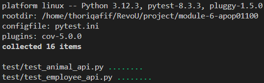
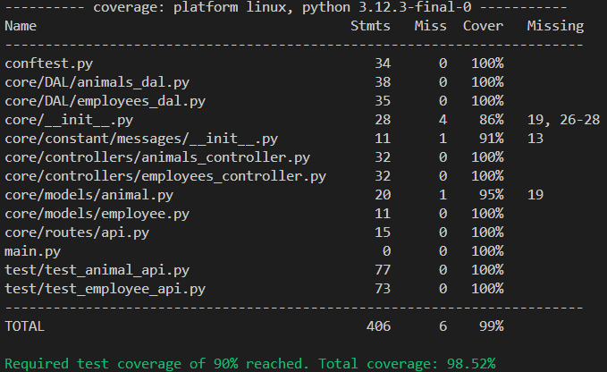

[](https://classroom.github.com/a/NzT-foTZ)

### ZOO'S ANIMALS API
[Zoo's Animlas API](https://tory-nicholle-apop01100-a5a11ec0.koyeb.app/animals)

### ZOO'S EMPLOYEES API
[Zoo's Employees API](https://tory-nicholle-apop01100-a5a11ec0.koyeb.app/employees)

### ZOO API UNIT TESTING RESULTS
#### Unit Testing Endpoint ```/animals``` and ```/employees``` API:


#### Coverage results:
